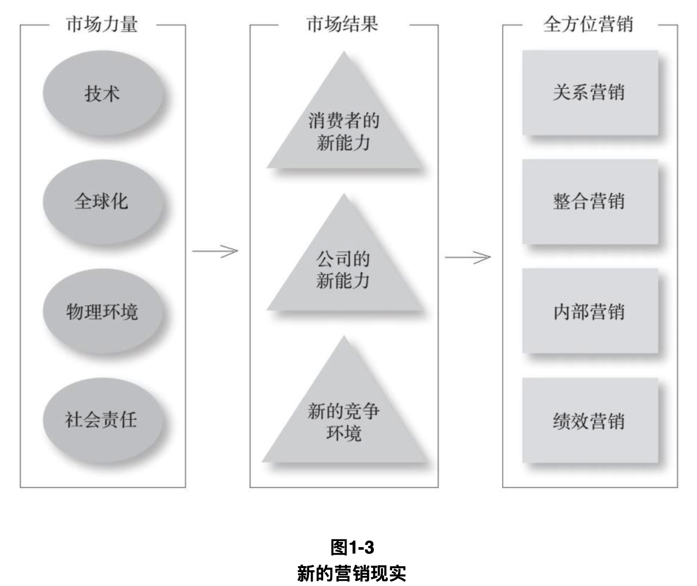

# 1） “市场营销的范畴”

“要想成为一名成功的营销人员，就必须对<mark style="color:red;">**营销的本质**</mark>、<mark style="color:red;">**可以营销什么**</mark>，以及<mark style="color:red;">**营销是如何运作的**</mark>有一个清晰的认识。”


## 1、什么是市场营销


```
市场营销（marketing）
是指以与组织目标相一致的方式识别并满足人类与社会的需求。
```



> 当谷歌（Google）认识到人们需要更快、更有效地访问互联网信息时，它创建了一个可以对查询结果进行分类和排序的强大搜索引擎。
>
> 当宜家家居注意到人们想要以足够低的价格购买优质家具时，它推出了可拆卸家具。
>
>
>
> 这两家公司很好地展现了高超的市场营销能力，<mark style="color:red;">**将个人的或社会的需求转变成可盈利的商业机会**</mark>。


美国市场营销协会提供了以下正式的定义：<mark style="color:orange;">**市场营销是创造、沟通、传递和交换对顾客、客户、合作伙伴和整个社会有价值的产品的一种活动、制度和过程**</mark>。

应对这些交换过程需要大量的工作和技能。当潜在交换各方中至少有一方考虑如何从其他方获取所期望的反应时，营销管理就出现了。

因此，**营销管理（marketing management）是选择目标市场并通过创造、传递和沟通卓越的顾客价值，来获取、维持和发展顾客的艺术和科学。**


区分市场营销的社会定义和管理定义。

市场营销的社会定义表明了市场营销在社会中所扮演的角色。例如，一个营销人员曾说过，市场营销的作用是“缔造更高质量的生活”。

我们对市场营销的社会定义如下：**市场营销是一个社会过程，在这个过程中，个人和群体通过创造、提供并与他人自由交换有价值的产品与服务来获取他们的所需所想。**消费者之间和消费者与企业之间共同创造价值，以及价值创造和分享的重要性，已经成为现代营销思想发展过程中的重要主题。”


“管理人员有时将市场营销视为“销售产品的艺术”，然而很多人在听到“销售并不是市场营销中最重要的部分”时会感到惊讶。销售只是市场营销的冰山一角。”

<figure><figcaption></figcaption></figure>

“当任天堂（Nintendo）发布Wii游戏机，苹果（Apple）推出iPad平板电脑，丰田（Toyota）推出普锐斯（Prius）混合动力汽车时，订单蜂拥而至。它们的成功不能仅仅归功于零售商出色的销售技巧，更确切地说，它们的巨大成功源于它们对消费者、竞争者，以及所有影响成本和需求的外部因素做了细致的工作，并在此基础上设计了正确的产品。”


## 2、营销什么


## 3、营销交换


\
